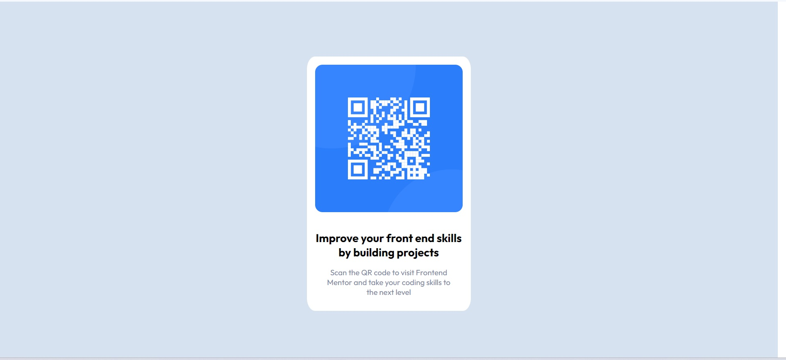

# Frontend Mentor - QR code component solution

This is a solution to the [QR code component challenge on Frontend Mentor](https://www.frontendmentor.io/challenges/qr-code-component-iux_sIO_H). Frontend Mentor challenges help you improve your coding skills by building realistic projects.

## Table of contents

- [Overview](#overview)
  - [Screenshot](#screenshot)
  - [Links](#links)
- [My process](#my-process)
  - [Built with](#built-with)
  - [What I learned](#what-i-learned)
  - [Continued development](#continued-development)
  - [Useful resources](#useful-resources)
- [Author](#author)

## Overview

This project is a component for a qr-code to be displayed on a card, using just HTML and CSS.

### Screenshot

### Links

- Solution URL: [https://github.com/i-prkr/qr-code](Github Repository)
- Live Site URL: [https://i-prkr.github.io/qr-code/](Hosted on Github Pages)

## My process

1. Read the brief and view the Figm designs, reading up on Figma as I had little previous experience.
2. Create and attach a stylesheet to the index.html file, import required font locally and create font-face for use.
3. Develop the layout for the design in HTML in the index.html file, remembering flex-box and basic css styling
4. Create the necessary elements in the design and style their positioning and colour correctly.
5. Finish styling of components including different font weights, border radius' and margins.

### Built with

- Semantic HTML5 markup
- Flexbox
- CSS classes

### What I learned

Primarily this was a good task to refresh some of my css styling knowledge and to begin familiarising with Figma. I found the shortcuts in Figma particularly useful to learn, especially holding CTRL to select elements, and holding ALT to view distances between elements for margining.

### Continued development

In this project I used basic CSS styling, I would like to begin implementing Tailwind CSS to projects.

### Useful resources

- [Beginner Dev Figma guide](https://www.smashingmagazine.com/2020/09/figma-developers-guide/) - This helped me with beginning to learn Figma and helpful shortcuts to get up and running.

## Author

- Website - [I Parker](https://github.com/i-prkr)
- Frontend Mentor - [@i-prkr](https://www.frontendmentor.io/profile/i-prkr)
